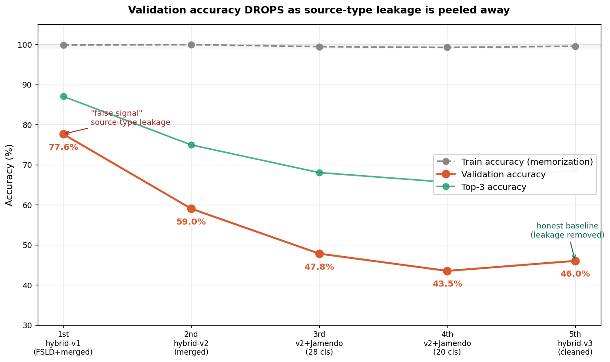
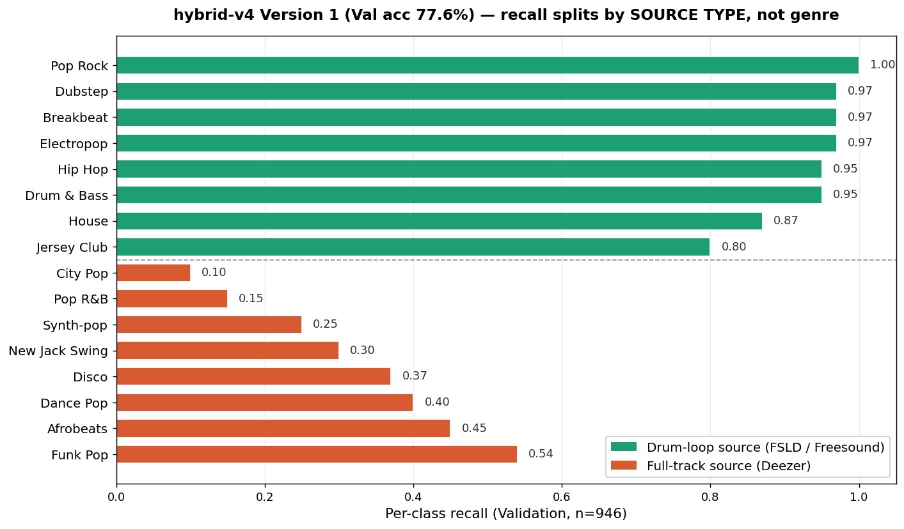

# Experiment Log — Tracking Down a False Signal

> SoundTag의 AST 장르 분류 실험 전체 기록.
> 핵심: validation accuracy 77.6%가 source-type leakage에 의한 가짜 신호임을
> 발견하고, 데이터의 소스 갭을 한 겹씩 제거하며 진짜 성능을 추적한 과정.
> 점수가 떨어지는 것이 곧 발전이었다.

---

## 1. 5번의 학습 — 점수 하락이 곧 진전

모두 동일한 AST 모델(`MIT/ast-finetuned-audioset-10-10-0.4593`) fine-tuning,
Kaggle T4 GPU, 10 epoch. 데이터 구성만 바꿔가며 학습.

| 학습 | 데이터셋 | 소스 구성 | 클래스 | 파일 | **Val Acc** | Top-3 | Train Acc |
|------|---------|----------|--------|------|-------------|-------|-----------|
| 1차 | hybrid-**v1** | FSLD + merged 혼합 | 26 | 4,730 | **77.6%** | 87.0% | 99.8% |
| 2차 | hybrid-**v2** | merged 중심 | 26 | 2,191 | **59.0%** | 74.9% | 99.9% |
| 3차 | v2 + Jamendo drums | full track + drum stem | 28 | 4,505 | **47.8%** | 68.0% | 99.4% |
| 4차 | v2 + Jamendo (정리) | 20 클래스로 축소 | 20 | 3,686 | **43.5%** | 65.6% | 99.2% |
| 5차 | hybrid-**v3** + Jamendo | 소스 정합성 확보 | 20 | 3,672 | **46.0%** | 68.7% | ~99% |

**읽는 법**: Train accuracy는 5번 내내 99%대에 고정. 모델은 항상 학습 데이터를
완벽히 외웠다. Validation만 77.6% → 46%로 떨어졌는데, 이는 성능 저하가 아니라
**모델이 외울 수 있었던 "소스 단서"가 데이터 정리와 함께 사라진 결과**다.
77.6%는 가짜였고, 46%가 이 문제의 정직한 baseline이다.

---

## 2. 77.6%는 왜 가짜였나 — source-type leakage

### 2-1. 결정적 증거: per-class recall이 소스 타입으로 갈린다

1차 학습(77.6%)의 classification report (Val 946개):

| 드럼루프 출신 (recall) | full track 출신 (recall) |
|---|---|
| Pop Rock 1.00, Dubstep 0.97 | City Pop **0.10**, Pop R&B **0.15** |
| Breakbeat 0.97, Electropop 0.97 | Synth-pop 0.25, New Jack Swing 0.30 |
| Hip Hop 0.95, Drum & Bass 0.95 | Disco 0.37, Dance Pop 0.40 |
| **평균 0.94** | **평균 0.32** |

드럼루프(FSLD/Freesound) 기반 장르는 recall 0.94, full track(Deezer) 기반
장르는 0.32. 모델은 **"드럼루프냐 full track이냐"는 거의 완벽히 구분**하고,
그 안에서 진짜 장르는 구분하지 못했다. 장르 라벨은 같아도 소스 타입이 다른
데이터를 한 데이터셋에 섞었기 때문에, 모델은 구분하기 쉬운 소스 특징을 학습했다.
77.6%는 소스가 쉽게 갈리는 클래스들이 끌어올린 평균값이었다.

### 2-2. K-pop 추론이 보여주는 거울 효과

같은 K-pop 1,874곡을 각 모델에 넣으면 완전히 다른 분포가 나온다.
모델이 K-pop을 이해한 게 아니라 각자의 학습 데이터 구성을 비추고 있었다.

| 모델 | K-pop Top-1 분포 (상위) |
|---|---|
| 1차 (77.6%) | Contemporary R&B 19.5%, Ballad 17.1%, Disco 12.3% |
| 5차 (46.0%) | Hip Hop 43.9%, House 12.2% |

→ 같은 곡, 다른 모델, 완전히 다른 답. 어느 것도 K-pop 자체를 평가한 결과가 아니다.

---

## 3. 근본 원인 — 측정 체계의 결함

단일 버그가 아니라 측정 방법 자체의 문제였다.

1. 5번의 학습이 전부 학습 데이터의 Train/Val split **내부**에서만 측정됨.
2. 정작 목표인 K-pop 성능은 단 한 번도 직접 평가되지 않음. (K-pop 추론은
   했지만 ground truth 라벨이 없어 "분포"만 관찰했을 뿐, 정확도 측정 불가.)
3. 좋은 모델을 만들기 전에, **무엇을 성능이라 부를지**가 잘못 정의되어 있었다.

---

## 4. 재설계 — measurement-first 프로토콜

### 4-1. K-pop hold-out 평가셋
- K-pop 100곡, **섹션 단위** 멀티라벨 (genres 1–3 + energy 1–5 + mood)
- 학습에 절대 사용하지 않는 hold-out. 모든 모델의 유일한 성능 기준.
- 상세: [`../md/labeling-guide.md`](../md/labeling-guide.md)

### 4-2. 모든 향후 실험 프로토콜
1. 실험 전 **1페이지 가설 문서** 작성 (반증 가능한 형태)
2. 24시간 quick test
3. **K-pop hold-out으로만** 성능 측정
4. confusion matrix 분석 → 다음 가설의 입력

### 4-3. 아키텍처 차원의 leakage 회피 — dual-model
소스 갭을 데이터로 섞지 않고 모델을 분리해 회피한다.
- **Model A** (드럼루프): hybrid v3 학습, 추론 시 Demucs drums stem 입력
- **Model B** (full track): Deezer 프리뷰 학습 (planned)

---

## 5. 노트북

| 파일 | 학습 | Val Acc |
|------|------|---------|
| `notebooks/hybrid-v4_1st_77.6.ipynb` | 1차 (가짜 신호) | 77.6% |
| `notebooks/hybrid-v4_2nd_59.ipynb` | 2차 | 59.0% |
| `notebooks/hybrid-v4_3rd_47.8.ipynb` | 3차 | 47.8% |
| `notebooks/hybrid-v4_4th_43.5.ipynb` | 4차 | 43.5% |
| `notebooks/hybrid-v4_5th_46.ipynb` | 5차 (정직한 baseline) | 46.0% |
| `notebooks/ast-fsld_45.2.ipynb` | 별도: FSLD 단일 | 45.2% |
| `notebooks/ast-deezer_42.1.ipynb` | 별도: Deezer 단일 | 42.1% |

> 학습 데이터(오디오)와 모델 가중치(`*.pt`, 각 345MB)는 용량·저작권 문제로
> git에서 제외. Kaggle 데이터셋(`soundtag-hybrid-v3`, `soundtag-kpop-previews`
> 등)으로 재현 가능.

---

## 6. 한 줄 결론

측정 기준이 틀리면 모델을 아무리 개선해도 의미가 없다.
77.6%는 떨어진 것이 아니라, 가짜였던 것이 드러난 것이다.
